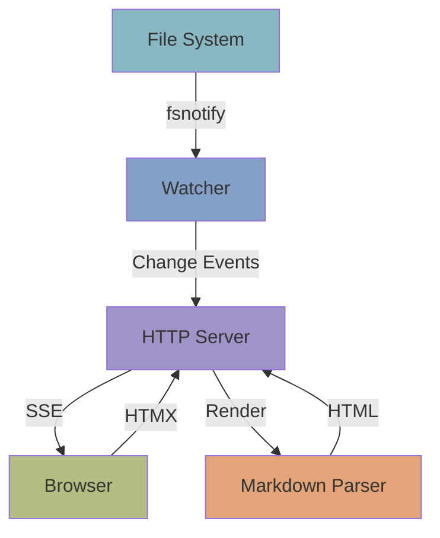
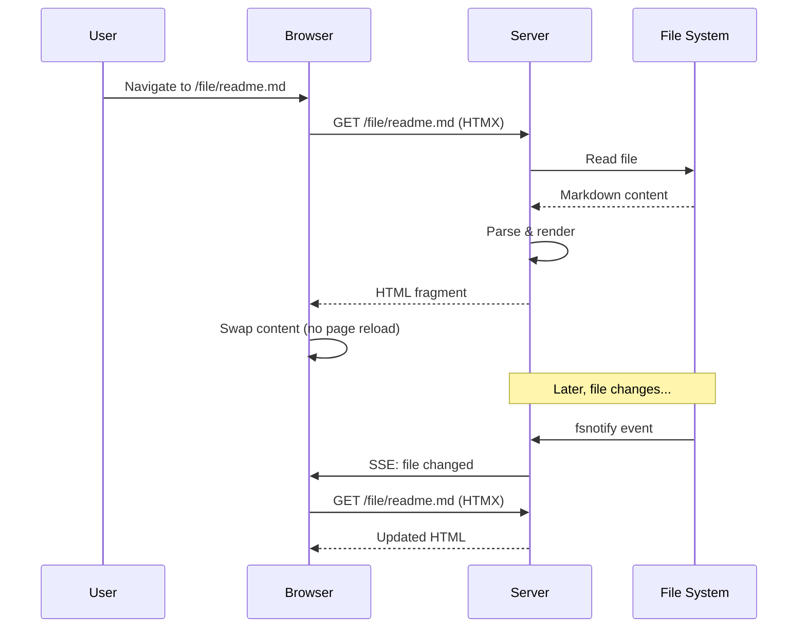

# Architecture

Stigmergic is a single Go binary with no runtime dependencies. Everything is embedded at compile time.

## How It Works



1. **Watcher** monitors the directory tree using `fsnotify` with debouncing
2. On file change, the **Server** pushes an event via SSE to connected browsers
3. The browser uses **HTMX** to fetch the updated content (partial page update, no full reload)
4. The **Markdown Parser** renders the file using Goldmark with extensions
5. HTML is generated by **Templ** templates and returned to the browser

## Request Flow



## Stack

| Layer | Technology | Purpose |
|-------|-----------|---------|
| CLI | [Cobra](https://github.com/spf13/cobra) | Command parsing |
| Config | [Viper](https://github.com/spf13/viper) | Hierarchical config (flags > env > file > defaults) |
| Watcher | [fsnotify](https://github.com/fsnotify/fsnotify) | File system events with debouncing |
| Server | Go `net/http` | HTTP server with middleware stack |
| Markdown | [Goldmark](https://github.com/yuin/goldmark) | CommonMark + GFM + extensions |
| Highlighting | [Chroma](https://github.com/alecthomas/chroma) | Syntax highlighting (Nord theme) |
| Templates | [Templ](https://templ.guide) | Type-safe HTML generation |
| Frontend | [HTMX](https://htmx.org) | Partial page updates |
| Styling | [Tailwind CSS](https://tailwindcss.com) | Utility-first CSS (compiled at build time) |
| Math | [KaTeX](https://katex.org) | LaTeX rendering (client-side) |
| Diagrams | [Mermaid](https://mermaid.js.org) | Diagram rendering (client-side) |

## Design Decisions

**No database.** All state comes from the filesystem. Discovery happens on-demand by scanning the directory tree. This keeps things simple and means your content is always just files — version-controlled, portable, yours.

**HTMX over SPA.** Navigation uses HTMX partial page updates instead of a JavaScript SPA framework. This means the server renders HTML, the browser swaps content, and there's no client-side routing or state management. Pages work without JavaScript (degraded but functional).

**Embedded assets.** Static files (CSS, JS, fonts) are embedded in the binary using Go's `embed` package. One binary, nothing to configure, nothing to lose.

**Security by default.** Path traversal protection, security headers, and read-only filesystem access. Stigmergic never writes to your files.

## Project Structure

```
stigmergic.dev/
├── cmd/stigmergic/       # CLI entry point
├── internal/
│   ├── config/           # Viper configuration
│   ├── embed/            # Embedded static assets
│   ├── logger/           # Structured logging
│   ├── markdown/         # Goldmark parser + extensions
│   ├── models/           # Data structures
│   ├── server/           # HTTP server + handlers
│   ├── theme/            # Theme loading
│   ├── watcher/          # File system watcher
│   └── workdir/          # Work directory management
├── web/templates/        # Templ HTML templates
├── example/              # Example content (this site!)
├── flake.nix             # Nix packaging
└── Makefile              # Build commands
```
