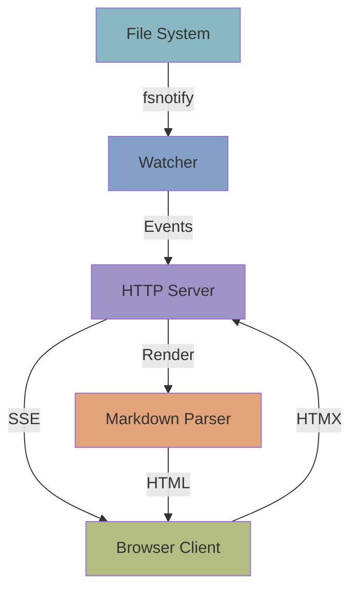
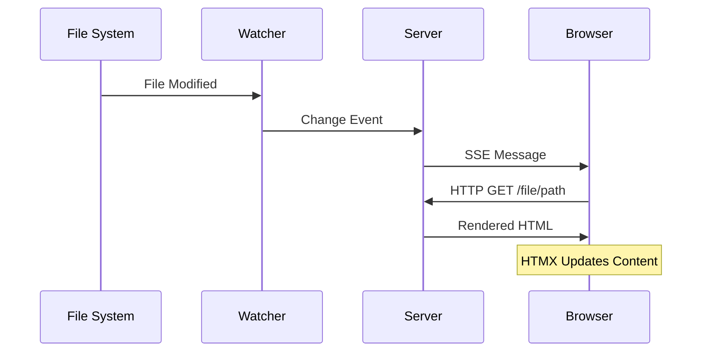
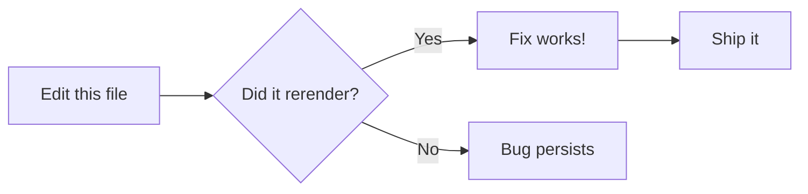
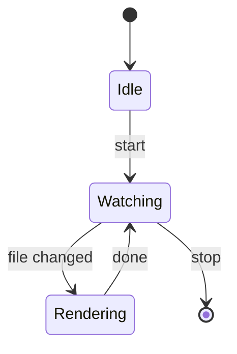

# stigmergic.dev - Feature Demonstration

**stigmergic.dev** is a *lightweight* markdown watcher and renderer built with [Go](https://go.dev/). This document showcases all supported markdown features.

## Overview

This project provides **real-time** markdown rendering with support for:

- Standard markdown formatting
- ~~Legacy features~~ Modern extensions
- Syntax highlighting for code
- Mathematical equations
- Interactive diagrams

## Installation

You can install stigmergic using Nix:

```bash
nix profile install github:Buildtall-Systems/stigmergic.dev
```

Or run directly:

```bash
nix run github:Buildtall-Systems/stigmergic.dev -- /path/to/docs
```

## Architecture

The system follows a simple architecture with three main components:

1. **File Watcher** - Monitors filesystem changes
2. **HTTP Server** - Serves rendered content
3. **Markdown Parser** - Processes markdown with extensions

### Core Implementation

Here's the core markdown parser initialization:

```go
package markdown

import (
	"bytes"

	"github.com/alecthomas/chroma/v2/formatters/html"
	"github.com/yuin/goldmark"
	"github.com/yuin/goldmark/extension"
	highlighting "github.com/yuin/goldmark-highlighting/v2"
	"github.com/yuin/goldmark/parser"
	gmhtml "github.com/yuin/goldmark/renderer/html"
)

func Parse(source []byte) ([]byte, error) {
	md := goldmark.New(
		goldmark.WithExtensions(
			extension.GFM,
			highlighting.NewHighlighting(
				highlighting.WithStyle("monokai"),
				highlighting.WithFormatOptions(
					html.WithLineNumbers(true),
				),
			),
			NewMathExtension(),
			NewMermaidExtension(),
			NewNostrExtension(),
		),
		goldmark.WithParserOptions(
			parser.WithAutoHeadingID(),
		),
		goldmark.WithRendererOptions(
			gmhtml.WithUnsafe(),
		),
	)

	var buf bytes.Buffer
	if err := md.Convert(source, &buf); err != nil {
		return nil, err
	}

	return buf.Bytes(), nil
}
```

## Feature Matrix

The following table shows browser compatibility:

| Feature | Chrome | Firefox | Safari | Status |
|---------|--------|---------|--------|--------|
| Markdown | ✓ | ✓ | ✓ | Stable |
| Syntax Highlighting | ✓ | ✓ | ✓ | Stable |
| Math Rendering | ✓ | ✓ | ✓ | Beta |
| Mermaid Diagrams | ✓ | ✓ | ✓ | Beta |
| Live Reload | ✓ | ✓ | ✓ | Stable |

## Project Roadmap

- [x] Basic markdown rendering
- [x] Syntax highlighting
- [x] File watching
- [x] Live reload via SSE
- [x] Theme support
- [ ] Full-text search
- [ ] Export to PDF
- [ ] Plugin system

## Mathematical Formulas

The average update latency can be expressed as:

$$\text{latency} = t_{\text{detect}} + t_{\text{process}} + t_{\text{render}}$$

Where performance targets require $t_{\text{total}} < 200\text{ms}$ for optimal user experience.

Inline math works too: $E = mc^2$ demonstrates energy-mass equivalence.

## System Architecture Diagram



## Data Flow Sequence



## Configuration Options

The server accepts the following configuration via `config.toml`:

| Option | Type | Default | Description |
|--------|------|---------|-------------|
| `port` | int | 8080 | HTTP server port |
| `host` | string | localhost | Bind address |
| `theme` | string | iceberg-dark | Color theme |

Example configuration snippet: `viper.SetDefault("port", 8080)`

## Community

Join the discussion on Nostr:

- Follow the project: nostr:npub1h0706bf312f273ee38df304671b38a94c6ef2313100af8b92898224990f115c
- Latest updates: nostr:note11d681c05cb04261a2de191cde2168b867d68aebe086bd11ce5e838b77efe6e20

## Performance Benchmarks

Initial testing shows promising results:

- Server startup: **< 100ms**
- File tree generation: **< 500ms** (1000 files)
- Markdown rendering: **< 50ms** per file
- Change detection to update: **< 200ms**

## Live Reload Test Diagram



## State Machine Test



## Conclusion

stigmergic.dev provides a **fast**, **beautiful**, and **extensible** way to read markdown documentation in real-time. Built with modern Go practices and leveraging the power of [`goldmark`](https://github.com/yuin/goldmark), [`htmx`](https://htmx.org), and [`templ`](https://templ.guide).

Visit [GitHub](https://github.com/Buildtall-Systems/stigmergic.dev) for source code and contributions.

---

*Generated with stigmergic.dev*
