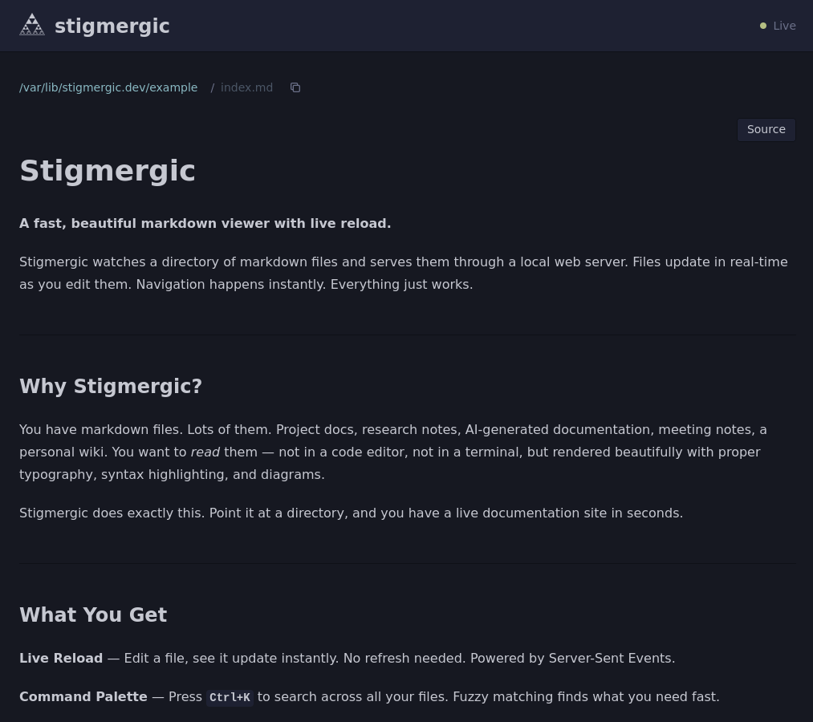
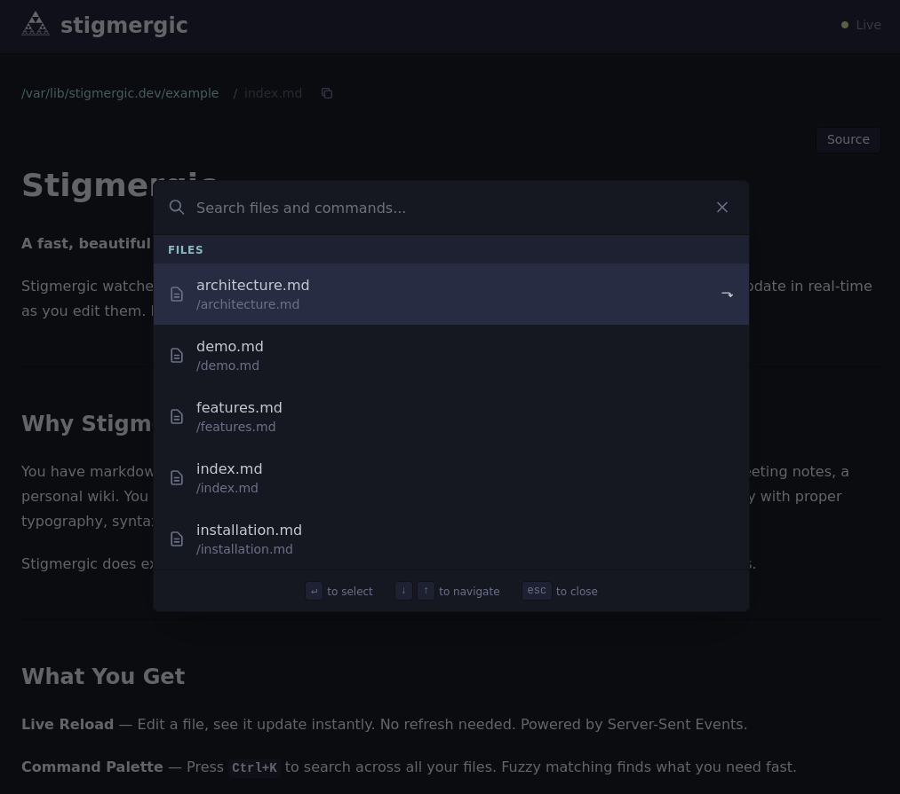

# Stigmergic

**A fast, beautiful markdown viewer with live reload.**

Stigmergic watches a directory of markdown files and serves them through a local web server. Files update in real-time as you edit them. Navigation happens instantly. Everything just works.



---

## Why Stigmergic?

You have markdown files. Lots of them. Project docs, research notes, AI-generated documentation, meeting notes, a personal wiki. You want to *read* them — not in a code editor, not in a terminal, but rendered beautifully with proper typography, syntax highlighting, and diagrams.

Stigmergic does exactly this. Point it at a directory, and you have a live documentation site in seconds.

---

## What You Get

**Live Reload** — Edit a file, see it update instantly. No refresh needed. Powered by [Server-Sent Events](https://developer.mozilla.org/en-US/docs/Web/API/Server-sent_events).

**Command Palette** — Press `Ctrl+K` to search across all your files. Fuzzy matching finds what you need fast.



**Syntax Highlighting** — Code blocks in any language, highlighted with the [Nord](https://www.nordtheme.com/) color scheme.

**Math & Diagrams** — LaTeX equations via [KaTeX](https://katex.org/). Flowcharts and sequence diagrams via [Mermaid](https://mermaid.js.org/). Write them in markdown, see them rendered.

**Nostr Links** — Native rendering of `nostr:` protocol URLs. npubs, notes, and events become clickable links.

**Directory Browsing** — Your file tree becomes your navigation. Folders expand. Files render. Simple.

**Themes** — Ships with Iceberg Dark and Light. Create your own with a [TOML](https://toml.io/) file.

---

## Quick Start

### Download

Pre-built binaries are available for every release:

| Platform | Architecture | Download |
|----------|-------------|----------|
| Linux | x86_64 | [stigmergic_linux_amd64.tar.gz](https://github.com/Buildtall-Systems/stigmergic.dev/releases/latest/download/stigmergic_linux_amd64.tar.gz) |
| Linux | ARM64 | [stigmergic_linux_arm64.tar.gz](https://github.com/Buildtall-Systems/stigmergic.dev/releases/latest/download/stigmergic_linux_arm64.tar.gz) |
| macOS | Apple Silicon | [stigmergic_darwin_arm64.tar.gz](https://github.com/Buildtall-Systems/stigmergic.dev/releases/latest/download/stigmergic_darwin_arm64.tar.gz) |
| macOS | Intel | [stigmergic_darwin_amd64.tar.gz](https://github.com/Buildtall-Systems/stigmergic.dev/releases/latest/download/stigmergic_darwin_amd64.tar.gz) |
| Windows | x86_64 | [stigmergic_windows_amd64.zip](https://github.com/Buildtall-Systems/stigmergic.dev/releases/latest/download/stigmergic_windows_amd64.zip) |

Extract and move to your `PATH`:

```bash
# Linux / macOS
tar xzf stigmergic_*.tar.gz
sudo mv stigmergic /usr/local/bin/

# Windows (PowerShell)
Expand-Archive stigmergic_*.zip -DestinationPath .
```

Verify checksums against the release's `checksums.txt`:

```bash
curl -sL https://github.com/Buildtall-Systems/stigmergic.dev/releases/latest/download/checksums.txt -o checksums.txt
sha256sum --check --ignore-missing checksums.txt
```

### Install (alternative methods)

```bash
# Nix (recommended)
nix profile install github:Buildtall-Systems/stigmergic.dev

# Go
go install github.com/Buildtall-Systems/stigmergic.dev/cmd/stigmergic@latest

# From source
git clone https://github.com/Buildtall-Systems/stigmergic.dev
cd stigmergic.dev
make build
```

### Run

```bash
stigmergic serve /path/to/your/markdown
```

Server starts at `http://localhost:8080`. Port adjusts automatically if occupied.

### Configure (optional)

Create `.stigmergic.toml` in your project or `~/.config/stigmergic/config.toml`:

```toml
port = 8080
host = "localhost"
theme = "iceberg-dark"
default_file = "README.md"
```

---

## Learn More

- [[features]] — Full list of capabilities with examples
- [[installation]] — Download, install, and configure
- [[architecture]] — How it works under the hood
- [[demo]] — Comprehensive markdown rendering showcase

---

## Use Cases

- **Agentic coding workflows** — AI tools generate mountains of markdown. Stigmergic makes it readable.
- **Research notes** — Browse and search collections of notes with live updates as you write.
- **Project documentation** — Real-time preview without a build step.
- **Personal wiki** — File-based, no database, version-controlled with git.
- **Knowledge bases** — Navigate large collections with the command palette.

---

## Built With

[Go](https://go.dev/), [HTMX](https://htmx.org), [Templ](https://templ.guide), [Goldmark](https://github.com/yuin/goldmark), [Tailwind CSS](https://tailwindcss.com), [KaTeX](https://katex.org), [Mermaid](https://mermaid.js.org).

No JavaScript frameworks. No build pipeline for your content. Just markdown files and a Go binary.

---

*Stigmergic is named after the biological phenomenon where organisms coordinate through environmental traces — ants leaving pheromones, termites building mounds. Your markdown files are the traces. Stigmergic makes them visible.*

[Source Code](https://github.com/Buildtall-Systems/stigmergic.dev) · [Buildtall Systems](https://buildtall.systems)
