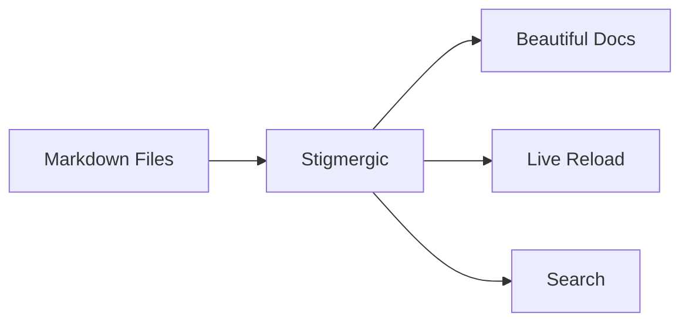

# Features

## Live Reload

Stigmergic uses [Server-Sent Events](https://developer.mozilla.org/en-US/docs/Web/API/Server-sent_events) to push file changes to your browser. When you save a file, the rendered view updates immediately — no manual refresh, no polling.

The watcher uses [`fsnotify`](https://github.com/fsnotify/fsnotify) with event debouncing to avoid redundant updates. It respects `.gitignore` patterns by default, so build artifacts and `node_modules` won't trigger reloads.

## Command Palette

Press **`Ctrl+K`** (or **`⌘+K`** on Mac) to open the command palette. It searches across all markdown files in your directory by filename. Results update as you type with fuzzy matching.

This is the fastest way to navigate large documentation sets. No need to browse the file tree — just type a few characters and jump directly to the file you need.

## Markdown Rendering

Full [CommonMark](https://commonmark.org/) compliance plus [GitHub Flavored Markdown](https://github.github.com/gfm/) extensions:

- **Tables** — pipe-delimited tables render as styled HTML
- **Task lists** — `- [x]` and `- [ ]` render as checkboxes
- **Strikethrough** — `~~deleted text~~` renders as ~~deleted text~~
- **Autolinks** — URLs automatically become clickable

## Syntax Highlighting

Code blocks with language annotations get syntax highlighting via [Chroma](https://github.com/alecthomas/chroma) with the [Nord](https://www.nordtheme.com/) theme:

```python
def fibonacci(n):
    if n <= 1:
        return n
    return fibonacci(n - 1) + fibonacci(n - 2)
```

```go
func main() {
    http.HandleFunc("/", func(w http.ResponseWriter, r *http.Request) {
        fmt.Fprintf(w, "Hello, stigmergic!")
    })
    log.Fatal(http.ListenAndServe(":8080", nil))
}
```

Supports all major languages: Go, Python, JavaScript, TypeScript, Rust, Bash, SQL, YAML, TOML, and many more.

## Math Rendering

LaTeX equations rendered client-side with [KaTeX](https://katex.org/).

**Block equations** with `$$`:

$$
\nabla \cdot \mathbf{E} = \frac{\rho}{\varepsilon_0}
$$

**Inline math** with single `$`: The quadratic formula is $x = \frac{-b \pm \sqrt{b^2 - 4ac}}{2a}$.

## Mermaid Diagrams

[Mermaid](https://mermaid.js.org/) diagrams render directly from fenced code blocks:



Supports flowcharts, sequence diagrams, class diagrams, state diagrams, and more.

## Nostr Protocol Links

URLs using the `nostr:` protocol are automatically parsed and rendered as clickable links. Supports npub, note, nevent, and nprofile identifiers.

## Wikilinks & Backlinks

`[[page]]` syntax links between documents by name, resolved against your whole tree — no relative paths to maintain. Every rendered page lists the documents that link *to* it, so connections stay visible from both ends. The navigation on this site's [[index]] uses them.

`![[page]]` embeds instead of linking: the target note renders inline in the host page. `![[page#Section]]` embeds one section, from its heading to the next heading of the same or a higher level, subsections included. Headings match exactly first and case-insensitively as a fallback, and a heading may itself contain wikilinks. `![[image.png]]` renders the image; any other file type embeds as a download link. A bare filename is searched in the served tree first, then in the directory named by the `attachment_root` setting (`--attachment-root` on the command line), which is where an Obsidian vault keeps its attachments. Embeds nest up to three levels deep. An unresolved target, an unmatched section, or a cycle renders a visible marker in place of the embed, never an error, and editing a transcluded note live-reloads every open page that shows it. The `example/transclusion/` corpus in the repository demonstrates every form.

## UI Wireframes

Fenced code blocks tagged `wiremd` render as sketch-style interface wireframes — mock up a settings page or a form directly in your markdown. See the [[demo]] for a live example.

## Themes

### Built-in

- **Iceberg Dark** (default) — dark background, cool blue-grey tones
- **Iceberg Light** — light background, same color palette

### Custom Themes

Create a TOML file at `~/.config/stigmergic/themes/{name}.toml`:

```toml
name = "my-theme"

[colors]
bg = "#1e1e1e"
fg = "#d4d4d4"
alt_bg = "#252526"
blue = "#61afef"
purple = "#c678dd"

[ui]
link = "#61afef"
link_hover = "#84c5ff"
code_bg = "#2d2d2d"
border = "#3e3e3e"
```

Use with `stigmergic serve --theme my-theme ./docs`.

## Smart Defaults

- **Auto port finding** — if port 8080 is busy, finds the next available port
- **Gitignore support** — respects `.gitignore` patterns (toggle with `--respect-gitignore=false`)
- **Default file** — set `--default-file README.md` to load a specific file on startup
- **Security headers** — X-Content-Type-Options, X-Frame-Options, path traversal protection
